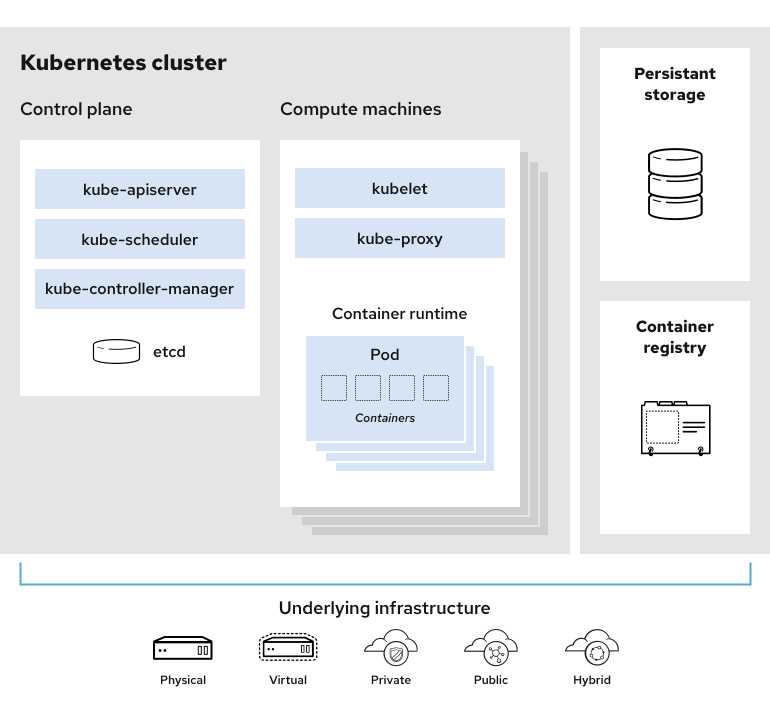

# Introduction

Kubernetes est un système open source permettant de gérer des applications conteneurisées sur plusieurs hôtes. Il fournit des mécanismes de base pour le déploiement, la maintenance et la mise à l'échelle des applications.

## Architecture de kubernetes

* **Control plane "Master Nodes"**
gestion, planification, ordonnencement et controle des workers nodes.
* **Workers nodes**
un ensemble de noeuds qui peuvent être virtuels ou physiques qui hébergent des applications sous forme de conteneurs.

### Control plan

Il contient les composants Kubernetes qui **contrôlent** le cluster, chargés de surveiller et de gérer les workers nodes .

Le plan de contrôle est en contact permanent avec les workers nodes. Si le cluster est configuré pour qu'il fonctionne d'une certaine manière. Le plan de contrôle s'assure que cette configuration est respectée.

* **kube-apiserver**
Orcheste toutes les opérations au sein du cluster et expose une API RESTE pour interagir avec le cluster.

* **kube-scheduler**
Composant sur le master qui surveille les pods nouvellement créés qui ne sont pas assignés à un nœud et sélectionne un nœud sur lequel ils vont s'exécuter.

* **kube-controller-manager**
Composant du master qui exécute les contrôleurs.
Logiquement, chaque contrôleur est un processus à part mais, pour réduire la complexité, les contrôleurs sont tous compilés dans un seul binaire et s'exécutent dans un seul processus.
Ces contrôleurs incluent :

* **Node Controller**
Responsable de détecter et apporter une réponse lorsqu'un nœud tombe en panne.
* **Replication** Controller
Responsable de maintenir le bon nombre de pods pour chaque objet ReplicationController dans le système.
* **Endpoints Controller**
Remplit les objets Endpoints (c'est-à-dire joint les Services et Pods).
* **Service Account & Token Controllers**
Créent des comptes par défaut et des jetons d'accès à l'API pour les nouveaux namespaces.
* **etcd**
« etcd » est une base de données clé-valeur qui comprend les données de configuration et les informations sur l'état du cluster. Distribuée et résistante aux pannes, la base de données etcd constitue la référence unique concernant cluster.

### Worker nodes

* **Kubelet**
Un agent qui s'exécute sur chaque nœud du cluster. Il s'assure que les conteneurs fonctionnent dans un pod.
* **kube-proxy**
kube-proxy est un proxy réseau qui s'exécute sur chaque nœud du cluster et implémente une partie du concept services de Kubernetes.
kube-proxy maintient les règles réseau sur les nœuds. Ces règles réseau permettent une communication réseau vers les Pods depuis des sessions réseau à l'intérieur ou à l'extérieur du cluster.
* **container Runtime**
L'environnement d'exécution de conteneurs est le logiciel responsable de l'exécution des conteneurs.
Kubernetes est compatible avec plusieurs environnements d'exécution de conteneur: Docker, containerd, cri-o, rktlet ainsi que toute implémentation de Kubernetes CRI (Container Runtime Interface).

> Next: [Context](./context.md)

> [cheat sheet](../useful.md)
