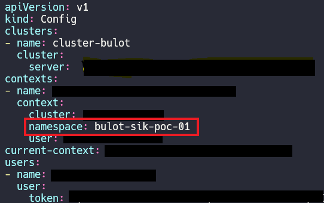

## Context

Si on cherche a changer le namespace par defaut d'une maniere permanante, on peut utiliser le `context` qui est stocker dans le fichier de conf de `kubectl`, souvent dans `$HOME/.kube/config`, ce dernier stock également les paramétres l'authentification pour y acceder au cluster



On peut aussi

```bash
kubectl config set-context my-context --namespace=my-namespace
```

ceci crée le context mais ne le demarre pas

on le demarre avec la commande suivante:

```bash
kubectl config use-context my-context
```

NB: les contexts peuvent étre utilisé pour gérer plusieurs clusters ou plusieurs utlisateurs `--users` et/ou `--clusters` dans la commande `set-context`

## Objets K8S

Tout dans K8S est representé par une ressource RESTful (Objet Kubernetes), chaque objet K8S existe dans un chemin HTTP; par exemple `https://your-k8s.com/api/v1/namespaces/default/pods/my-pod` represente le pod `my-pod` dans le namespace `default`
La commande kubectl lance une requete HTTP sur l'URL pour y acceder aux objets K8S.
Par defaut la sortie de la commande `kubectl get` omit plusieurs details, l'ajout du flag `-o wide` affiche plus de details. si on veut voir l'objet complet, `-o json` pour une sortie en JSON ou `-o yaml` pour YAML.
`kubectl` à une option pratique `--no-headers` qui peut aider si on fait un pipe avec grep, awk,....
autre option pratique si on cherche a recupérer une information spéciphique on utilsant des requets JSONPath

```bash
kubectl get pods my-pod -o jsonpath --template={.status.podIP}
```

Pour voir les détails d'un objet on peut également utiliser:

```bash
kubectl describe <resource-name> <obj-name>
```


> Next: [Namespace](../objects/namespace.md)

> [cheat sheet](../useful.md)

