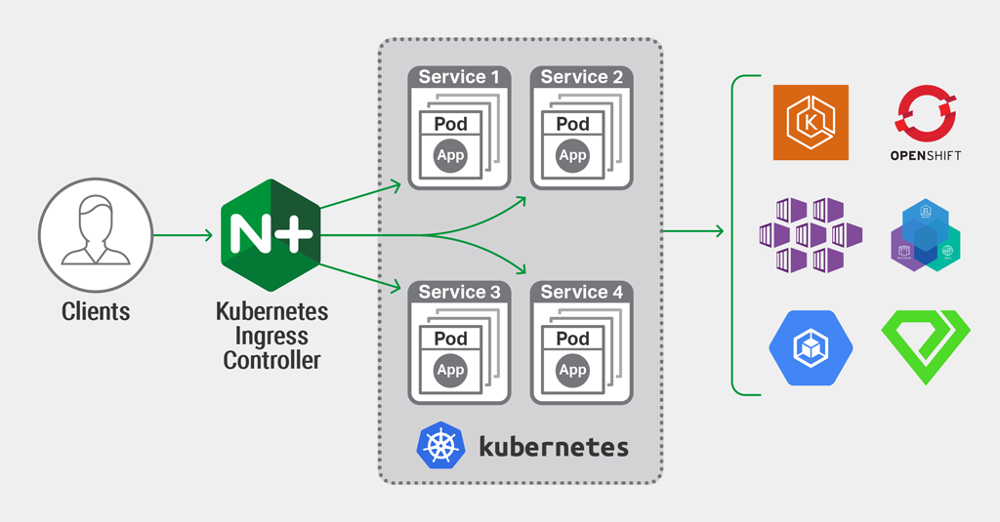

## Ingress
* Un Ingress est un objet Kubernetes qui gère l'accès externe aux services dans un cluster, généralement du trafic HTTP.

* Un Ingress peut fournir un équilibrage de charge, une terminaison TLS et un hébergement virtuel basé sur un nom.

* Ingress (ou une entrée réseau), ajouté à Kubernetes v1.1, expose les routes HTTP et HTTPS de l'extérieur du cluster à des services au sein du cluster. Le routage du trafic est contrôlé par des règles définies sur la ressource Ingress.

------------------------------------------------------


#### Ingress controller										

```yaml						
apiVersion: extensions/v1beta1						
kind: Deployement			
metadata:						
  name: nginx-ingress-controller
spec:
  replicas: 1
  selector:
    matchLabels:
      name: nginx-ingress
  template:
    matadata:
      labels:
        name: nginx-ingress
    spec:
      containers:
        - name: nginx-ingress-controller
          image: quay.io/kubernetes-ingress-controller/nginx-ingress-controller:0.21.0
      args:
        - /nginx-ingress-controller
	- --configmap=$(POD_NAMESPACE)/nginx-configuration
      env:
	- name: POD_NAME
	  valueFrom:
	    fieldRef:
	      fieldPath: metadata.name
	- name: POD_NAMESPACE
	  valueFrom:
	    fieldRef:
	      fieldPath: metadata.namespace
```

```
kubectl create -f configmaps-demo.yaml
kubectl create -f pod-demo.yaml
```


```
kubectl get secrets
kubectl describe secrets
```


Next: [Storage](../objects/storage.md)
