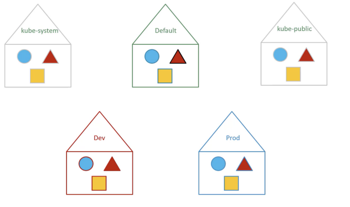

# Namesapce

* Kubernetes prend en charge plusieurs clusters virtuels sauvegardés par le même cluster physique. Ces clusters virtuels sont appelés `namespaces`.
* un bon moyen pour diviser et limiter les ressources physiques du cluster entre plusieurs utilisateurs
* permet l'utilisation du même cluster pour des envirenemnt differents (DEV, PREPROD, PROD)
* par de defaut le namespace est `default`
* si on veux lancer la commande `kubectl` pour un namespace spécifique on rajoute le flag `--namespace` ou `--all-namespace` pour tout les namespace dans le cluster



chemin d'access ''database-sql.dev.svc.cluster.local'' -> pod-name.namespace.service.domain

```yaml
---
apiVersion: v1
kind: Pod
metadata:
  name: pod-demo
  namespace: dev
  labels:
    app: myapp
    type: front-end
spec:
  containers:
    - name:  nginx-container
      image: nginx
```

```bash
kubectl create -f pod.yml
kubectl create -f pod.yml --namespace=dev
```

```yaml
apiVersion: v1
kind: Namespace
metadata:
  name: dev
```

```bash
kubectl create -f namespace.yml
kubectl create namespace dev
kubectl get pods --namespace=dev
kubectl get pods --all-namespace

kubectl config set-context $(kubectl config current-context) --namespace=dev
```

## Quota

```yaml
apiVersion: v1
kind: ResourceQuota
metadata:
  name: compute-quota
  namespace: dev
spec:
  hard:
    pods: "10"
    requests.cpu: "4"   # un pod ne peut pas demander plus de 4 CPU
    requests.memory: 5Gi  # un pod ne peut pas demander plus de 5G de memoire
    limits.cpu: "10"
    limits.memory: 10Gi
```

```bash
kubectl create -f compute-quota.yml
```

> Next: [Pods](../objects/pods.md)

> [cheat sheet](../useful.md)
