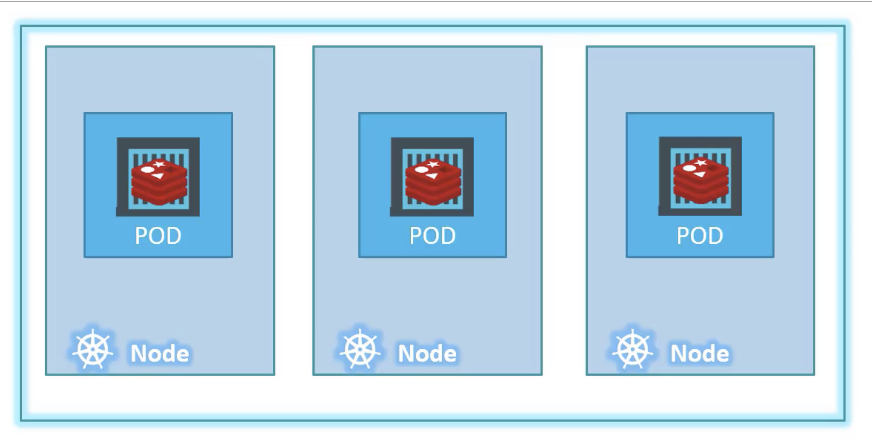

## Pods 
* Kubernetes ne deploie pas des conteneurs directement sur les nodes
* les conteneurs sont encapsulées dans un object appelé pods.
* Un pod est un groupe d'un ou de plusieurs conteneurs
* Un pod est une instance unique d'une application
* les conteneurs du mème pod partage le meme reseau





```
kubectl run nginx --image nginx

kubectl get pods [-o wide|yaml|json]
```

## structure du fichier de manifeste YAML


```yaml
---
apiVersion:
kind:
metadatas:


spec:


```

## Pod.yaml

```yaml
---
apiVersion: v1			# String
kind: Pod			# String		
metadata:                       # Dictionnaire 
  name: pod-demo
  labels:
    app: myapp
    type: front-end
spec:
  containers:                   # List/Array
    - name:  nginx-container    # 1er element
      image: nginx
```

```
kubectl create -f pod.yaml
kubectl apply -f pod.yaml
```

```
kubectl describe pod pod-demo
```

Next: [ReplicatSets](../objects/replicatSet.md)

[Useful command](../useful.md)
