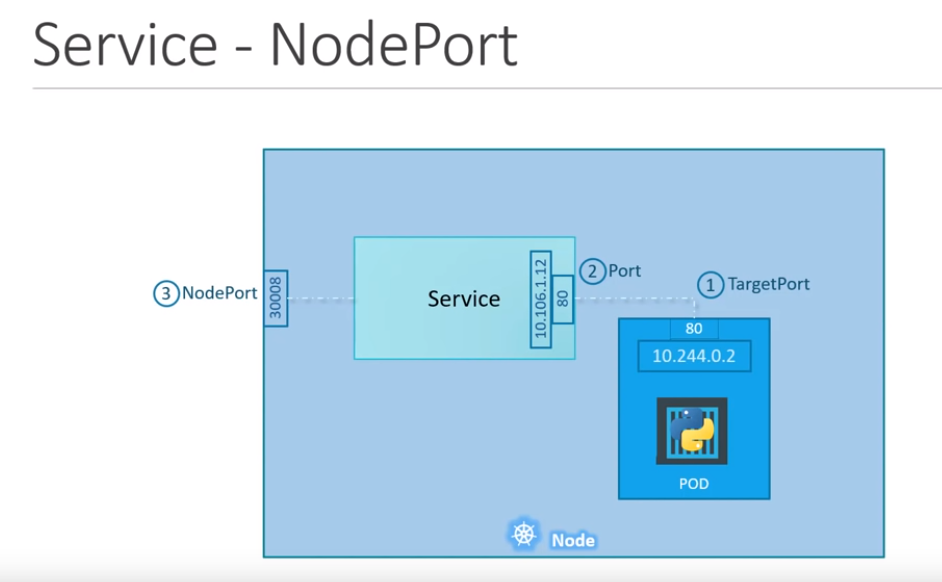

# Services

* Une manière abstraite d'exposer une application s'exécutant sur un ensemble de Pods en tant que service réseau.
* Un service identifie ses pods membres à l'aide d'un sélecteur. Pour qu'un pod soit membre du service, il doit comporter tous les libellés spécifiés dans le sélecteur.


```yaml
---
apiVersion: v1
kind: Pod
metadata:
  name: my-nginx
  labels:
    app: myapp
    type: frontend
spec:
  containers:
    - name: nginx-container
      image: nginx
  ...
```

```yaml
---
apiVersion: v1
kind: Service
metadata:
  name: my-service
spec:
  selector:
    type: frontend
```

## Types de services

* **ClusterIP**
le service crée une adresse IP virtuelle à l'intérieur du cluster pour permettre la communication entre différents services tels qu'un ensemble de serveurs frontaux à un ensemble de serveurs principaux.

```yaml
---
apiVersion: v1
kind: Service
metadata:
  name: back-end
spec:
  type: ClusterIP
  ports:
    - targetPort: 80
      port: 80
  selector:
    name: myapp
    type: backend
```

```bash
kubectl create -f service-demo.yaml
```

* **NodePort**
le service rend un POD interne accessible sur un port du nœud [30000-32767]



```yaml
---
apiVersion: v1
kind: Service
metadata:
  name: myapp-service
spec:
  type: NodePort
  ports:
    - targetPort: 80
      port: 80
      nodePort: 30080
  selector:
    name: myapp
    type: frontend
```

```bash
kubectl create -f service-demo.yaml
```

* **Loadbalancer** : il fournit un équilibreur de charge pour notre service dans les fournisseurs de cloud pris en charge.


```yaml
---
apiVersion: v1
kind: Service
metadata:
  name: myapp-service
spec:
  type: LoadBalancer
  externalIPs:
  - LB_address
  ports:
    - targetPort: 80
      port: 80
  selector:
    name: myapp
    type: frontend
```

```bash
kubectl create -f service-demo.yaml
```

```yaml
apiVersion: v1
kind: Namespace
metadata:
  name: dev
```

> Next: [ConfigMaps](../objects/configApp.md)

> [cheat sheet](../useful.md)
